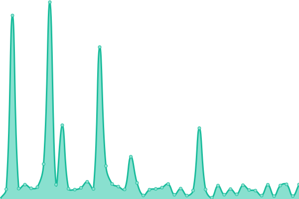

# [📈 Live Status](https://ivao-portugal.github.io/status-page): <!--live status--> **🟩 All systems operational**

This repository contains the open-source uptime monitor and status page for [IVAO Portugal](https://pt.ivao.aero), powered by [Upptime](https://github.com/upptime/upptime).

With [Upptime](https://upptime.js.org), you can get your own unlimited and free uptime monitor and status page, powered entirely by a GitHub repository. We use [Issues](https://github.com/ivao-portugal/status-page/issues) as incident reports, [Actions](https://github.com/ivao-portugal/status-page/actions) as uptime monitors, and [Pages](https://ivao-portugal.github.io/status-page) for the status page.

<!--start: status pages-->
<!-- This summary is generated by Upptime (https://github.com/upptime/upptime) -->
<!-- Do not edit this manually, your changes will be overwritten -->
<!-- prettier-ignore -->
| URL | Status | History | Response Time | Uptime |
| --- | ------ | ------- | ------------- | ------ |
|  [Website](https://pt.ivao.aero/portal) | 🟩 Up | [website.yml](https://github.com/IVAO-Portugal/status-page/commits/HEAD/history/website.yml) | 

 4366ms
     
 | 

<a href="https://status.pt.ivao.aero/history/website">98.01%</a>
    

|  [Events](https://events.pt.ivao.aero) | 🟩 Up | [events.yml](https://github.com/IVAO-Portugal/status-page/commits/HEAD/history/events.yml) | 

 2747ms
     
 | 

<a href="https://status.pt.ivao.aero/history/events">98.57%</a>
    

|  API | 🟩 Up | [api.yml](https://github.com/IVAO-Portugal/status-page/commits/HEAD/history/api.yml) | 

 7520ms
     
 | 

<a href="https://status.pt.ivao.aero/history/api">98.30%</a>
    

|  Discord Bot (Weather) | 🟩 Up | [discord-bot-weather.yml](https://github.com/IVAO-Portugal/status-page/commits/HEAD/history/discord-bot-weather.yml) | 

 472ms
     
 | 

<a href="https://status.pt.ivao.aero/history/discord-bot-weather">100.00%</a>
    

<!--end: status pages-->

[**Visit our status website →**](https://ivao-portugal.github.io/status-page)

## 📄 License

- Powered by: [Upptime](https://github.com/upptime/upptime)
- Code: [MIT](./LICENSE) © [IVAO Portugal](https://pt.ivao.aero)
- Data in the `./history` directory: [Open Database License](https://opendatacommons.org/licenses/odbl/1-0/)
